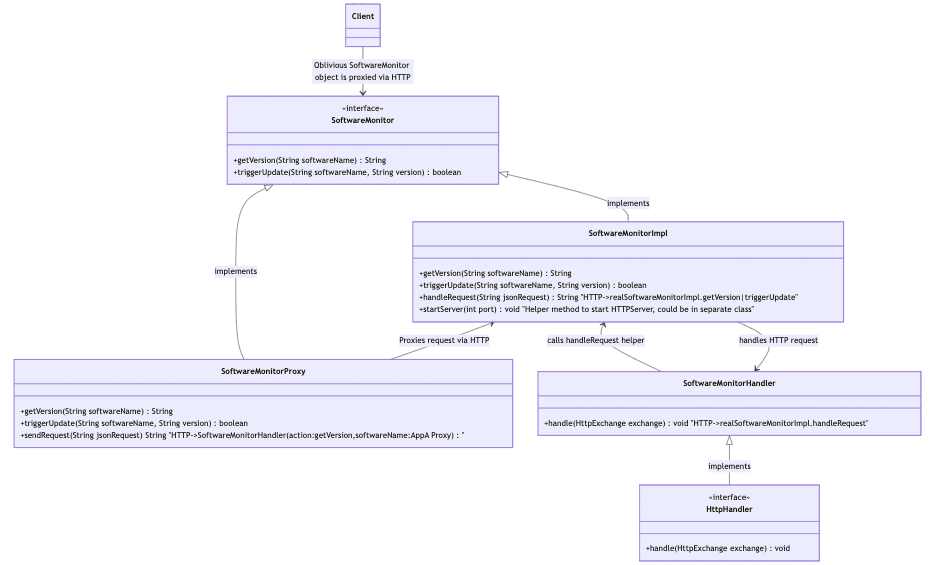

# Example Remote Proxy Pattern

## UML
* To edit or modify copy this text to [Mermaid Live](https://mermaid.live/edit)
```text
classDiagram
    Client --> SoftwareMonitor : Oblivious SoftwareMonitor object is proxied via HTTP
    SoftwareMonitorHandler <|-- HttpHandler : implements
    SoftwareMonitor <|-- SoftwareMonitorProxy : implements
    SoftwareMonitor <|-- SoftwareMonitorImpl : implements
    SoftwareMonitorImpl <-- SoftwareMonitorProxy : Proxies request via HTTP
    SoftwareMonitorImpl <-- SoftwareMonitorHandler : calls handleRequest helper
    SoftwareMonitorImpl --> SoftwareMonitorHandler : handles HTTP request
    class Client {

    }
    class HttpHandler {
        <<interface>>
        +handle(HttpExchange exchange) void
    }
    class SoftwareMonitor {
        <<interface>>
        +getVersion(String softwareName) String
        +triggerUpdate(String softwareName, String version) boolean
    }
    class SoftwareMonitorImpl {
        +getVersion(String softwareName) String
        +triggerUpdate(String softwareName, String version) boolean
        +handleRequest(String jsonRequest) String "HTTP->realSoftwareMonitorImpl.getVersion|triggerUpdate"
        +startServer(int port) void "Helper method to start HTTPServer, could be in separate class"
    }
    class SoftwareMonitorProxy {
        +getVersion(String softwareName) String
        +triggerUpdate(String softwareName, String version) boolean
        +sendRequest(String jsonRequest) String "HTTP->SoftwareMonitorHandler(action:getVersion,softwareName:AppA Proxy)"
    }
    class SoftwareMonitorHandler {
        +handle(HttpExchange exchange) void "HTTP->realSoftwareMonitorImpl.handleRequest"
    }

```

## UML Image
